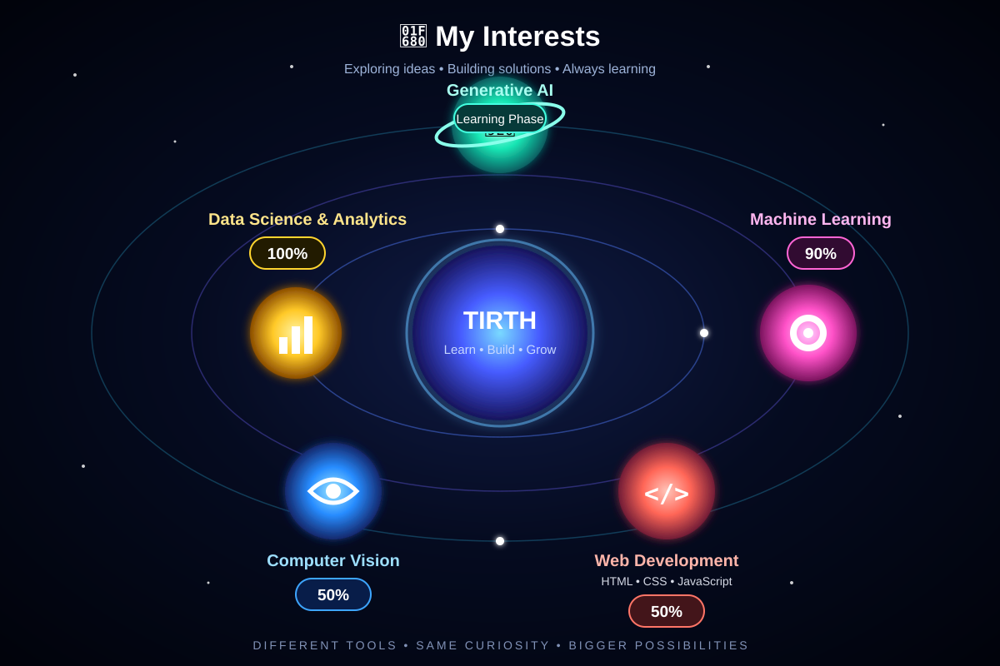

<!-- ======================= HEADER ======================= -->

<h1 align="center">
  Hi 👋, I'm Tirth Madane
</h1>

<h3 align="center">
  Data Science & AI Enthusiast | Machine Learning | Data Analytics
</h3>

  
  
  

  

<!-- ======================= ANIMATED INTRO ======================= -->

  

---

## 👨‍💻 About Me

- 🎓 Final-year **B.Tech Computer Engineering** student
- 📊 Focused on **Data Science, Machine Learning & Data Analytics**
- 🤖 Currently exploring **Generative AI & Agentic AI**
- 📈 Experienced with **Python, SQL, Power BI & Data Visualization**
- ☁️ Exploring **Cloud, Docker & modern AI technologies**
- 🚀 I enjoy turning data and ideas into practical solutions

---

## 🌱 Currently Learning

---

# 🛠️ Tech Stack

### 👨‍💻 Programming

### 🤖 AI / Machine Learning

### 📊 Data Science & Analytics

### 🗄️ Database

### 🌐 Frameworks & Development

### ☁️ Cloud & Tools

# 🔥 Contribution Streak

  

---

---
---

# 🐍 Contribution Graph

  

---
## 🚀 My Interests

  

---

# 🤝 Let's Connect

---

  <i>Building with data. Exploring AI. Creating with purpose.</i>

